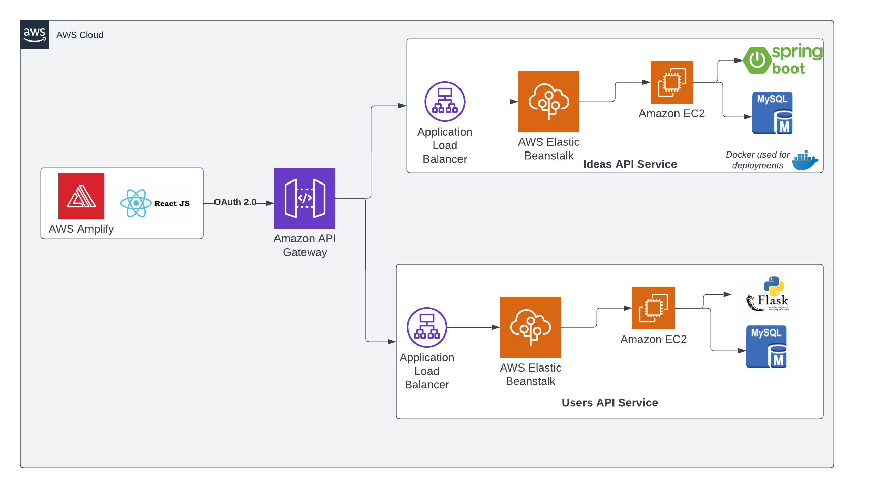
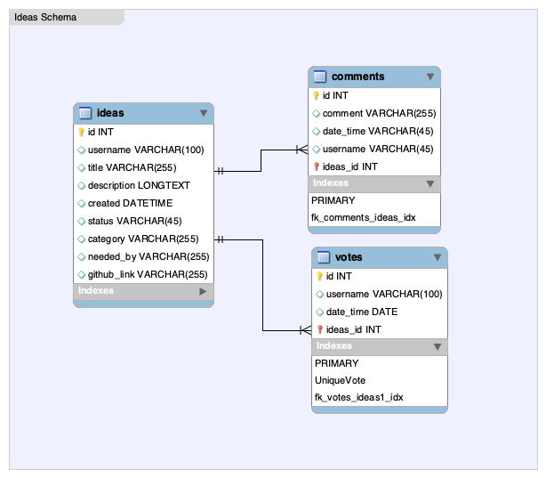

# Project Ideas
## AHA Ideas Team

## Title
** Build a tool like AHA Ideas: https://www.aha.io/pricing?product=Ideas **

## Introduction to the problem statement
- Help businesses and companies access bright ideas from employees and customers; and, help increase customer satisfaction.
- Allow companies and people to crowdsource feedback, engage the community, and analyze trends.
- Build a modern UI and platform where users can painlessly share ideas with one another.
- Apply modern cloud computing practices to build a scalable and highly available platform.

## Abstract
In today's world, companies have a lot of diversity. The greater the diversity is , more the different point of views, different types of ideas. Our project/idea management tool aims to share ideas between the companies and to engage the community within the company. With the help of a modern UI and an easily usable platform, users can easily access bright ideas from employees and customers.

To create a scalable and a highly available platform , microservices were used. The services were kept separate from each other and each service had its own database and was deployed in an AWS instance. The endpoints of the authentication service and the ideas service were then exposed and was accessible to the react application.
Users were able to successfully share their ideas, upvote their favourite ideas and give valuable comments.

## Feature Scope
- Allows companies to create a whitelabel solution.

## Architecture

(All components deployed in AWS Cloud)

## Database Schema

### User Authentication Service

### Ideas API Service

## UI WireFrames
### Sign Up

### Login

### Portal

### Suggestion Post 

## Approach
The approach was to not have a single monolithic system but to divide and deploy the application using microservices architecture. Within a microservices architecture, every different task/service is being handled by different microservice components which makes it easier to scale and deploy the application. 

We used agile methodology to iterate our development week over week until our product was ready. We also demonstrated the project to friends and family who fit the project’s personas.

Our approach was continuous development and integration using Docker, Github, and AWS.

The microservices architecture consisted of three parts: 
1)  React application for frontend development
2) User authentication service (Developed using  Flask)
3) Ideas Service API (Developed using JAVA Spring Boot)

### User authentication Service:

https://documenter.getpostman.com/view/20514020/Uyxbq9Rc

Sample Request

`curl --location --request GET 'http://52.207.242.60:5000/all-users'`

- API Endpoints:
1. Get users API: This endpoint is a get request and returns all the users which are using the system.
2. Login API: This endpoint is a post request and takes in the username and the password as body and returns a response. If the user credentials are correct , a session ID will be returned back as a response, if not an error message will be returned.
3. Register API:This endpoint is a post request and takes in the user credentials as body and returns a response. If the user credentials are correct , a session ID will be returned back as a response, if not an error message will be returned.
4. Get active sessions: This endpoint is a get request and will give all the current active sessions.

### Ideas Service:

https://documenter.getpostman.com/view/877303/UyxbppYy

Sample Request

`curl --location --request GET 'http://ideasapi-env.eba-mcygtrsp.us-west-2.elasticbeanstalk.com/ideas'`

- API Endpoints:

1.Get Ideas: This endpoint is a get request and returns all the ideas.

2.Create Idea: This endpoint is a post request and takes the category of the idea, the username of the user creating this idea and the title and description of the idea as a body and returns back a response.

3.Create Comment: This endpoint is a post request and takes the ID of the idea that the user wants to comment on, the username of the user creating this idea and the comment as a body and returns back a response.

4.Vote idea:This endpoint is a post request and takes the category of the idea, the username of the user voting for  this idea and the title and description of the idea as a body and returns back a response.

## UML Use Case Diagrams

#### 1. Use-Case : User

#### 2. Use-Case : Admin

## Personas
- Personas are vital to the success of any product because they drive the design decisions by looking at the common user requirements and bringing them to the initial view in planning before the design process starts. Personas provided our team with a shared understanding of the users in terms of goals and capabilities. As a result, this project is aimed for supporting:

  - Product managers - These users are the primary target users of our platform. These users want a summarized dashboard and visualization of ideas on a platform. We have built an admin panel with powerful visualization for these users.
  - Engineers - these users look for new ideas to improve services or products. They look for an easy way to share ideas and start developing on them. Our platform allows users to post ideas easily and integrate with Github.
  - Product Development Teams - These teams often scout for ideas using  surveys, but by using our platform they will have access to private, exclusive, and a broad spectrum of ideas. This will help companies innovate, manage portfolios of ideas, and help marketing initiatives.
  - Corporate Leadership - leaders often have many ideas, but they are risk averse. By using the voting feature of our platform, these leaders will be able to tell which idea is powerful.
  - Customers - many customers have complaints, but many also have good ideas for a company they support. This user is  interested in an easy way to post a new idea for a company. Our platform will allow that.
  - Other Employees - all employees of a company can have meaningful ideas to share. It’s often the case that many good ideas go unheard because one’s role does not have the opportunity to table an idea. By using our platform, this user will meet his/her requirement of commenting on an idea and voting on an idea to show support.

## Dataset links / References (if any)
https://www.aha.io/ideas/overview

